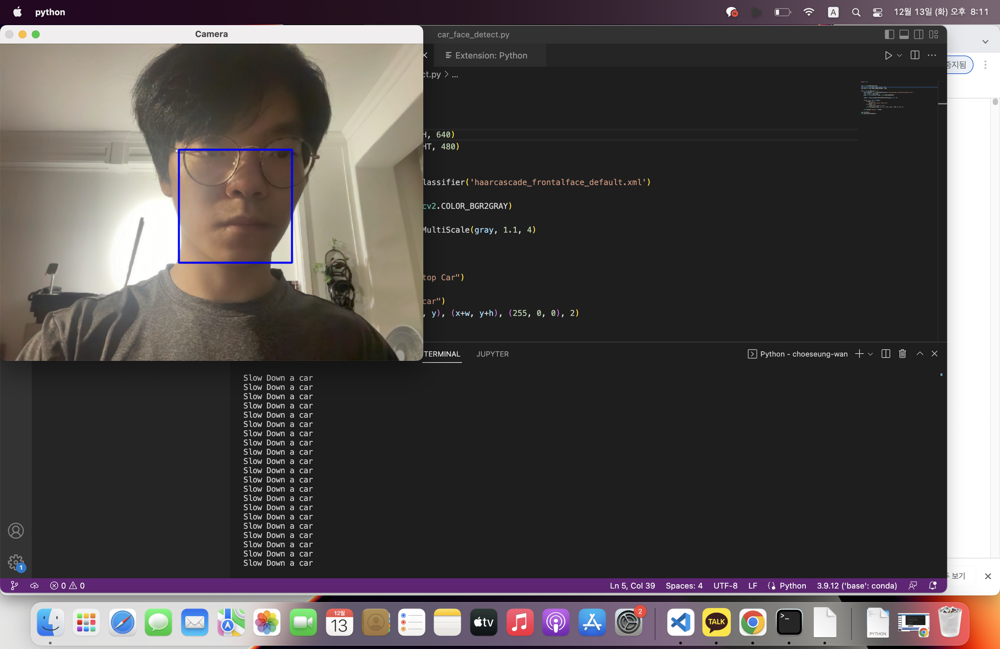

# OUTLINE
I made a program related to self-driving cars.
It recognizes a person's face as a frame through a webcam and outputs a signal that stops the car or slows down if the frame size is more than a certain degree.

# EX IMAGE

# USED PACKAGE & SOURCE
haarcascade_frontalface_default.xml (from https://github.com/opencv/opencv/tree/master/data/haarcascades)

# HOW TO USE
When the program is executed, the webcam is turned on to recognize a person's face as a frame and output a warning according to its size.
Press any key to exit the program.

# REF
Lecture 12 Learning Materials OpenCV-1